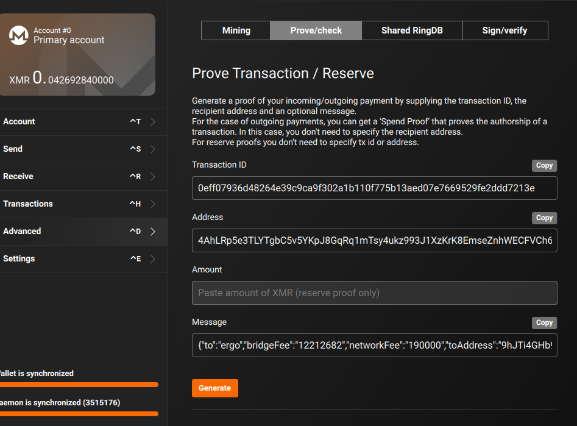

# Bringing Monero to Rosen Bridge

Monero’s privacy features make it an awkward guest in any cross-chain bridge. Transactions reveal neither sender nor amount, and popular wallets refuse to carry arbitrary metadata. Yet Rosen still needs a shared vault that guards can control and verifiable intent data for watchers. This proof-of-concept shows how to get both without compromising Monero’s privacy model.

## TL;DR
- Guards can manage a shared Monero vault using multisig and wallet RPC.
- Users prove their lock intent by attaching Rosen metadata to a Monero spend proof and publishing the proof on Ergo.
- Guards and watchers can verify that proof automatically; no custom wallet builds required.
- Taking this live mostly means running reliable full nodes, wrapping the scripts in services, and giving users a smoother proof flow.

## Why Monero Is Tricky to Bridge
Three Monero traits drive the design:
- **Stealth outputs and ring signatures** hide who paid and which outputs are spendable. Only wallets that share multisig state can view deposits.
- **RingCT** masks the amount, so bridges must trust wallet RPC balance reports instead of explorer data.
- **No reliable metadata channel.** Consumer wallets ignore custom `tx_extra`, eliminating the usual “lock data” approach.

## Architecture at a Glance
1. Guards bootstrap a shared Monero multisig wallet (e.g., 2-of-4) via wallet RPC.
2. Users lock XMR into that address.
3. Users generate a spend proof (`check_tx_proof`) with Rosen metadata in the message field.
4. Users publish the proof plus plaintext metadata on Ergo—or hand it to Rosen tooling that can do so on their behalf.
5. Watchers verify the proof, pair it with the Monero deposit, and hand the event to Rosen’s guard service.
# Bringing Monero to Rosen Bridge

## Building the Shared Vault
Monero multisig is interactive. Each signer exports multisig info until the wallet reports it is ready. Enable `enable-multisig-experimental` once per wallet before running the flow.

```python
import json
import requests
from requests.auth import HTTPDigestAuth

RPC_URL = "http://localhost:18083/json_rpc"
auth = HTTPDigestAuth("testuser", "testpass")
wallets = [
    {"filename": "multi181", "password": "pass1"},
    {"filename": "multi182", "password": "pass2"},
    {"filename": "multi183", "password": "pass3"},
    {"filename": "multi184", "password": "pass4"},
]

def call(method, params=None):
    payload = {"jsonrpc": "2.0", "id": "0", "method": method, "params": params or {}}
    res = requests.post(
        RPC_URL,
        auth=auth,
        headers={"Content-Type": "application/json"},
        data=json.dumps(payload),
    ).json()
    if "error" in res:
        raise RuntimeError(res["error"])
    return res["result"]

prepared = []
for wallet in wallets:
    call("open_wallet", wallet)
    prepared.append(call("prepare_multisig"))

round_infos = []
for idx, wallet in enumerate(wallets):
    peers = [info for j, info in enumerate(prepared) if j != idx]
    call("open_wallet", wallet)
    round_infos.append(
        call("make_multisig", {"multisig_info": peers, "threshold": 2, "password": wallet["password"]})
    )

for _ in range(8):
    if all(call("is_multisig")["ready"] for _ in wallets):
        break
    updated = []
    for wallet in wallets:
        call("open_wallet", wallet)
        updated.append(
            call("exchange_multisig_keys", {"password": wallet["password"], "multisig_info": round_infos})
        )
    round_infos = [info for info in updated if info]

addresses = []
for wallet in wallets:
    call("open_wallet", wallet)
    addresses.append(call("get_address")["address"])
assert len(set(addresses)) == 1
print(f"Shared multisig address: {addresses[0]}")
```

Once the script prints the shared address, all signers are in sync and the wallet is ready to receive deposits.

### Seeing the Address Again Later
Any signer can reopen the wallet and call `get_address` to rediscover the shared address:

```python
call("open_wallet", {"filename": "multi181", "password": "pass1"})
print(call("get_address")["address"])
```

### Tracking Balance and Incoming Transfers
Wallet RPC exposes balance and transfer history, even for multisig wallets, after signers import each other’s multisig info.

```python
status = call("get_balance", {"account_index": 0})
print(f"Total balance: {status['balance'] * 1e-12:.6f} XMR")
print(f"Unlocked balance: {status['unlocked_balance'] * 1e-12:.6f} XMR")

incoming = call("get_transfers", {"in": True, "pending": True, "account_index": 0})
for payment in incoming.get("in", []):
    print(payment["txid"], payment["amount"] * 1e-12)
```

### What Exactly Is a “Private View Key”?
Monero wallets hold two types of secrets:
- A **spend key pair** that authorizes actual transfers.
- A **view key pair** that reveals which incoming outputs belong to the wallet.

Sharing the private half of the view key gives someone read access only. They can see deposits and amounts tied to that wallet, but they cannot move funds, construct spends, or learn anything about other wallets on the network. Think of it as giving watchers a glass wall into the vault—they can count coins but never reach them.

### Giving Watchers Read-Only Access
We share the private view key with Rosen watchers, along with a view-only wallet file. That setup lets them observe balances without any ability to sign transactions.

```python
view_key = call("query_key", {"key_type": "view_key"})["key"]
print(f"Share this read-only view key with watchers: {view_key}")
```

Watchers run a dedicated `monero-wallet-rpc` instance with the view-only wallet or start the GUI/CLI wallet in view-only mode. They reuse `get_balance` and `get_transfers` to monitor locks in near real time, while guards retain exclusive control of the spend keys.

## Spending from the Vault
To approve payouts, guards sync multisig info, construct a draft transfer without broadcasting, collect signatures, and finally submit the transaction.

```python
import json
import requests
from requests.auth import HTTPDigestAuth

RPC_URL = "http://localhost:18083/json_rpc"
auth = HTTPDigestAuth("testuser", "testpass")
wallets = [
    {"filename": "multi181", "password": "pass1"},
    {"filename": "multi182", "password": "pass2"},
]

def call(method, params=None):
    payload = {"jsonrpc": "2.0", "id": "0", "method": method, "params": params or {}}
    res = requests.post(
        RPC_URL,
        auth=auth,
        headers={"Content-Type": "application/json"},
        data=json.dumps(payload),
    ).json()
    if "error" in res:
        raise RuntimeError(res["error"])
    return res["result"]

for wallet in wallets:
    call("open_wallet", wallet)
    exported = call("export_multisig_info")
    call("import_multisig_info", {"info": [exported]})

creator = wallets[0]
call("open_wallet", creator)
call("set_daemon", {"address": "http://127.0.0.1:18081", "trusted": True})
transfer = call(
    "transfer",
    {
        "destinations": [{"address": "44AFFq5kSiGBoZ...", "amount": int(0.001 * 1e12)}],
        "account_index": 0,
        "do_not_relay": True,
        "priority": 1,
        "ring_size": 16,
    },
)
multisig_txset = transfer.get("multisig_txset") or transfer.get("tx_data_hex")

co_signer = wallets[1]
call("open_wallet", co_signer)
signed = call("sign_multisig", {"tx_data_hex": multisig_txset})
final_data = signed.get("tx_data_hex", multisig_txset)
result = call("submit_multisig", {"tx_data_hex": final_data})
print(f"Broadcasted hashes: {result.get('tx_hash_list', [])}")
```

Guardrails worth keeping:
- Always sync multisig info (`export_multisig_info` / `import_multisig_info`) before building a spend.
- Set `do_not_relay` on the draft transfer so nothing hits the network before signatures are collected.
- A production guard service would orchestrate signer order, retries, and fee policy.

## Asking Users to Prove Their Lock
The UX story matters more than the RPC details. In the official Monero GUI wallet:
1. Open the **Prove/check** tab.
2. Paste the lock transaction ID and the Rosen multisig address.
3. Enter the Rosen metadata JSON in the `Message` field.



The wallet outputs a base58 proof string. The metadata message can include any Rosen fields; here is a canonical example:

```json
{
  "to": "ergo",
  "bridgeFee": "12212682",
  "networkFee": "190000",
  "toAddress": "9hJTi4GHb9cbLovbxJsAJ9TtU42CDnuWJ8w8Q4CfA3kpExRrAFw",
  "fromAddress": ["monero_pub_spend_key"]
}
```

Users then publish both the proof and the plaintext JSON on Ergo (e.g., through a simple helper app or a form). Because only the locker could have created the proof, Rosen can also accept the proof directly and post it to Ergo for them without sacrificing integrity.

## Verifying Proofs Automatically
Guards and watchers rely on wallet RPC to validate proofs before honoring a bridge request.

```python
import argparse
import json
import requests
from requests.auth import HTTPDigestAuth

def call(url, auth, method, params=None):
    payload = {"jsonrpc": "2.0", "id": "0", "method": method, "params": params or {}}
    res = requests.post(url, auth=auth, headers={"Content-Type": "application/json"}, data=json.dumps(payload)).json()
    if "error" in res:
        raise RuntimeError(res["error"])
    return res["result"]

def verify(url, auth, tx_id, address, message, proof):
    return call(
        url,
        auth,
        "check_tx_proof",
        {"txid": tx_id, "address": address, "message": message, "signature": proof},
    )

def main():
    parser = argparse.ArgumentParser()
    parser.add_argument("--rpc-url", default="http://localhost:18083/json_rpc")
    parser.add_argument("--rpc-user", default="testuser")
    parser.add_argument("--rpc-pass", default="testpass")
    parser.add_argument("--wallet", default="multi181")
    parser.add_argument("--wallet-password", default="pass1")
    parser.add_argument("--txid", required=True)
    parser.add_argument("--address", required=True)
    parser.add_argument("--message", required=True)
    parser.add_argument("--proof", required=True)
    args = parser.parse_args()

    auth = HTTPDigestAuth(args.rpc_user, args.rpc_pass)
    call(args.rpc_url, auth, "open_wallet", {"filename": args.wallet, "password": args.wallet_password})
    print(json.dumps(verify(args.rpc_url, auth, args.txid, args.address, args.message, args.proof), indent=2))

if __name__ == "__main__":
    main()
```

The response returns `good: true` when the proof matches the transaction and message. Guards simply enforce a confirmation threshold before treating the event as final.

## Why This Holds Up
- **Soundness:** Only the owner of the output can generate a valid proof for the exact message, preventing metadata tampering.
- **Completeness:** Every Monero wallet that supports spend proofs can produce one; no custom tooling is required.
- **Operational Considerations:** Guards need redundant `monerod` and wallet RPC nodes, automated multisig info syncing, and alerting for height drift.

## Path to Production
- Harden the automation scripts (error handling, resumable workflows, secret storage) and wrap them inside Rosen guard services.
- Define the canonical metadata schema and add Ergo-side endpoints for proof submission.
- Build a user helper (CLI or lightweight desktop) that generates the proof and submits the Ergo payload automatically.
- Implement a Monero scanner that watches wallet RPC for new deposits and correlates them with submitted proofs.

## What Would Make This Even Better
- **A Monero dApp connector.** Direct wallet integrations (browser extension or desktop bridge) would let Rosen request transfers and proofs without manual RPC setups.
- **Streamlined proof UX.** A URI scheme or lightweight helper that opens the wallet with prefilled metadata would cut down on user copy-paste errors.
- **Automated Ergo submission.** A service that posts the proof and metadata to Ergo on the user’s behalf would remove the final manual step.

## Closing Thoughts
This experiment shows that Rosen Bridge can embrace Monero without weakening either project’s core principles. Guards retain custody through familiar multisig flows, users keep their privacy, and watchers still receive verifiable intent data. From here, the hardest work is polishing the user journey and running reliable infrastructure—not waiting for new cryptography.


